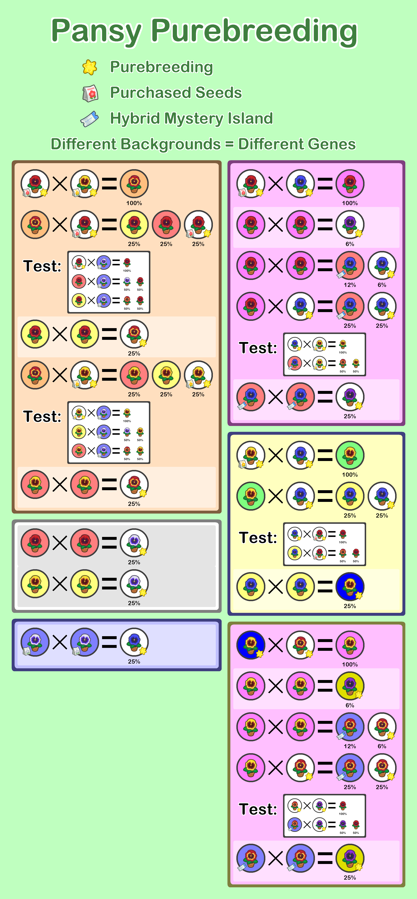

# Animal Crossing: New Horizons - Flower Purebreeding

## Table of Contents

* [To-Do List](#to-do-list)
* [Windflowers](#windflowers)
* [Hyacinths](#hyacinths)
* [Pansies](#pansies)
* [Tulips](#tulips)
* [Q&A](#qa)

## To-Do List

* Cosmos
* Mums
* Lilies
* Roses

## Windflowers

[Back to Top](#table-of-contents)

## Hyacinths

[Back to Top](#table-of-contents)

## Pansies

[Back to Top](#table-of-contents)

## Tulips

[Back to Top](#table-of-contents)

## Q&A

**Q: What is this? How is this guide different from other guides?**

A: The goal of most flower guides out there is just to get you each color, no matter what their genes are in the background.

This guide aims to get as many purebreeds as possible, in addition to each color.

**Q: What does purebreed mean?**

A: You might have noticed that if you breed two flowers of the same color, you might get a new color.

If a flower is purebreeding, then breeding two copies of it together will always result in another identical clone.

In other words, breeding two of the same purebreeding flower together will always give you the same color.

**Q: Why would I want purebreeds?**

A: To be blunt, this guide is not for most people. Getting all purebreeds will require much more work than just gettting each color.

However, there are several advantages to getting all purebreeds:
* Two identical purebreeds will clone themselves when bred. Because there is a higher chance to breed two flowers than to clone a single flower, this allows you to duplicate flowers faster.
* If you collect every purebreed of a flower type, you are able to breed literally any color or gene you want with a 100% chance, by mixing and matching different purebreeds.

**Q: What are the "Tests" in these guides?**

A: Some breeding pairs will result in flowers that have the same color but different genes.

These flowers can be differentiated by "test" breeding with another flower.

Because they have different genes behind the scene, they will produce children with different colors.

[Back to Top](#table-of-contents)